# WhatsApp Engine Rust - Major Architectural Improvements

## Executive Summary

This document outlines major architectural improvements to transform the WhatsApp Engine Rust from a well-functioning service into a highly modular, extensible, and production-ready system designed for **on-premise/client-side deployment**. These improvements focus on plugin-based extensibility, local modularity, and preparation for future cloud-ready variants while maintaining excellent performance on end-user machines.

## Current Architecture Assessment

### ✅ **Strengths of Current Implementation**
- Clean service-oriented architecture with trait-based abstractions
- Simplified authentication state machine (already implemented)
- Good separation of concerns between browser, auth, and chat services
- Async-first design with proper error handling
- Configuration management and logging infrastructure

### 🔧 **Areas for Major Architectural Enhancement**

**For Current On-Premise Variant:**
1. **Plugin/Extension System Architecture** ⭐ (Priority 1)
2. **Local Event System & Hooks** ⭐ (Priority 1) 
3. **Modular Service Registry Pattern** ⭐ (Priority 2)
4. **Configuration Management & Feature Flags** ⭐ (Priority 2)
5. **Local Observability & Monitoring** ⭐ (Priority 3)

**For Future Cloud-Ready Variant:**
6. **Multi-Instance & Session Management** 🌐 (Future)
7. **Distributed Resource Pool Management** 🌐 (Future)
8. **Event-Driven Architecture with Message Bus** 🌐 (Future)

---

## 🚀 Major Architectural Improvements

### 1. **Dependency Injection & Service Registry Pattern**

**Current Issue**: Manual service instantiation and tight coupling in `WhatsAppService::new()`

**Proposed Solution**: Implement a service registry pattern with dependency injection container

```rust
// New architectural pattern
pub trait ServiceRegistry: Send + Sync {
    fn register<T: Service>(&mut self, service: T) -> Result<()>;
    fn get<T: Service>(&self) -> Result<Arc<T>>;
    fn get_by_name(&self, name: &str) -> Result<Arc<dyn Service>>;
}

pub trait Service: Send + Sync {
    fn name(&self) -> &'static str;
    fn dependencies(&self) -> Vec<&'static str>;
    fn initialize(&mut self, registry: &dyn ServiceRegistry) -> Result<()>;
    fn health_check(&self) -> Result<ServiceHealth>;
}

pub struct ServiceContainer {
    services: HashMap<String, Arc<dyn Service>>,
    dependency_graph: DependencyGraph,
    lifecycle_manager: ServiceLifecycleManager,
}
```

**Benefits**:
- Loose coupling between services
- Easier testing with mock services
- Dynamic service registration and discovery
- Graceful service startup/shutdown ordering
- Hot-swappable service implementations

### 2. **Event-Driven Architecture with Message Bus**

**Current Issue**: Tight coupling between services, no real-time event propagation

**Proposed Solution**: Implement an event bus pattern for decoupled communication

```rust
// Event-driven architecture
pub trait EventBus: Send + Sync {
    async fn publish<T: Event>(&self, event: T) -> Result<()>;
    async fn subscribe<T: Event>(&self, handler: EventHandler<T>) -> Result<SubscriptionId>;
    async fn unsubscribe(&self, subscription_id: SubscriptionId) -> Result<()>;
}

#[derive(Debug, Clone)]
pub enum WhatsAppEvent {
    AuthenticationStateChanged { 
        old_state: AuthState, 
        new_state: AuthState, 
        timestamp: u64 
    },
    MessageReceived { 
        from: String, 
        content: MessageContent, 
        timestamp: u64 
    },
    ConnectionStatusChanged { 
        status: ConnectionStatus, 
        timestamp: u64 
    },
    QRCodeGenerated { 
        qr_code: String, 
        expiry_timestamp: u64 
    },
    BrowserInstanceCreated { 
        instance_id: String, 
        timestamp: u64 
    },
    ErrorOccurred { 
        error: WhatsAppError, 
        context: ErrorContext, 
        timestamp: u64 
    },
}

pub struct EventBusImpl {
    channels: HashMap<String, Vec<EventChannelSender>>,
    middleware: Vec<Box<dyn EventMiddleware>>,
    persistence: Option<Box<dyn EventStore>>,
}
```

**Benefits**:
- Real-time event propagation to external systems
- Decoupled service communication
- Event sourcing capabilities
- Webhook delivery system
- Audit logging and replay functionality

### 3. **Plugin/Extension System Architecture**

**Current Issue**: Monolithic service structure, difficult to extend functionality

**Proposed Solution**: Plugin architecture for extensible functionality

```rust
// Plugin architecture
pub trait Plugin: Send + Sync {
    fn name(&self) -> &'static str;
    fn version(&self) -> &'static str;
    fn dependencies(&self) -> Vec<PluginDependency>;
    fn initialize(&mut self, context: &PluginContext) -> Result<()>;
    fn shutdown(&mut self) -> Result<()>;
}

pub trait AuthPlugin: Plugin {
    async fn on_auth_start(&self, context: &AuthContext) -> Result<AuthPluginAction>;
    async fn on_auth_success(&self, context: &AuthContext) -> Result<()>;
    async fn on_auth_failure(&self, context: &AuthContext, error: &AuthError) -> Result<()>;
}

pub trait MessagePlugin: Plugin {
    async fn on_message_send(&self, context: &MessageContext) -> Result<MessagePluginAction>;
    async fn on_message_receive(&self, context: &MessageContext) -> Result<()>;
    async fn process_message(&self, message: &mut Message) -> Result<()>;
}

pub struct PluginManager {
    loaded_plugins: HashMap<String, Box<dyn Plugin>>,
    plugin_registry: PluginRegistry,
    dependency_resolver: PluginDependencyResolver,
}
```

**Example Plugins**:
- **Analytics Plugin**: Message statistics and usage analytics
- **Security Plugin**: Message encryption and validation
- **Webhook Plugin**: External system integrations
- **Rate Limiting Plugin**: Advanced rate limiting strategies
- **Backup Plugin**: Automatic data backup and recovery

### 4. **Multi-Instance & Session Management**

**Current Issue**: Single browser instance, no session isolation

**Proposed Solution**: Multi-instance session management with resource pooling

```rust
// Multi-instance architecture
pub trait SessionManager: Send + Sync {
    async fn create_session(&self, config: SessionConfig) -> Result<SessionId>;
    async fn get_session(&self, session_id: &SessionId) -> Result<Option<Arc<Session>>>;
    async fn destroy_session(&self, session_id: &SessionId) -> Result<()>;
    async fn list_sessions(&self) -> Result<Vec<SessionInfo>>;
}

pub struct Session {
    id: SessionId,
    user_id: Option<String>,
    browser_instance: Arc<BrowserInstance>,
    auth_state: Arc<Mutex<AuthState>>,
    message_queue: Arc<MessageQueue>,
    created_at: SystemTime,
    last_activity: Arc<Mutex<SystemTime>>,
    configuration: SessionConfig,
}

pub struct SessionPool {
    active_sessions: HashMap<SessionId, Arc<Session>>,
    session_factory: Arc<dyn SessionFactory>,
    resource_manager: Arc<ResourceManager>,
    cleanup_scheduler: TaskScheduler,
}
```

**Benefits**:
- Multiple concurrent WhatsApp sessions
- User-specific session isolation
- Resource optimization through pooling
- Session persistence and recovery
- Load balancing across instances

### 5. **Advanced Observability & Monitoring Architecture**

**Current Issue**: Basic logging, no comprehensive monitoring

**Proposed Solution**: Complete observability stack with metrics, tracing, and monitoring

```rust
// Observability architecture
pub trait MetricsCollector: Send + Sync {
    fn counter(&self, name: &str) -> Counter;
    fn histogram(&self, name: &str) -> Histogram;
    fn gauge(&self, name: &str) -> Gauge;
    fn record_span(&self, span: Span) -> SpanRecorder;
}

pub struct ObservabilityStack {
    metrics: Arc<dyn MetricsCollector>,
    tracer: Arc<dyn Tracer>,
    logger: Arc<dyn StructuredLogger>,
    health_checker: Arc<HealthChecker>,
    alerting: Arc<AlertingSystem>,
}

#[derive(Debug)]
pub struct WhatsAppMetrics {
    pub auth_success_rate: f64,
    pub message_send_latency: Duration,
    pub browser_instance_count: u64,
    pub active_sessions: u64,
    pub queue_depth: u64,
    pub error_rate: f64,
}

pub trait HealthChecker: Send + Sync {
    async fn check_health(&self) -> HealthStatus;
    async fn check_service_health(&self, service: &str) -> ServiceHealthStatus;
    async fn get_system_status(&self) -> SystemStatus;
}
```

**Features**:
- Prometheus metrics integration
- Distributed tracing with OpenTelemetry
- Custom health check endpoints
- Real-time dashboards
- Automated alerting and notifications

### 6. **Resource Pool Management & Auto-Scaling**

**Current Issue**: No resource management, manual scaling

**Proposed Solution**: Dynamic resource management with auto-scaling

```rust
// Resource management architecture
pub trait ResourcePool<T>: Send + Sync {
    async fn acquire(&self) -> Result<PooledResource<T>>;
    async fn release(&self, resource: PooledResource<T>) -> Result<()>;
    async fn scale_up(&self, count: usize) -> Result<()>;
    async fn scale_down(&self, count: usize) -> Result<()>;
    fn current_size(&self) -> usize;
    fn active_count(&self) -> usize;
}

pub struct BrowserInstancePool {
    instances: Vec<Arc<BrowserInstance>>,
    available: VecDeque<Arc<BrowserInstance>>,
    scaling_policy: ScalingPolicy,
    resource_monitor: ResourceMonitor,
}

pub struct AutoScaler {
    pools: HashMap<String, Box<dyn ResourcePool<dyn Send + Sync>>>,
    scaling_policies: HashMap<String, ScalingPolicy>,
    metrics_collector: Arc<dyn MetricsCollector>,
}

#[derive(Debug, Clone)]
pub struct ScalingPolicy {
    pub min_instances: usize,
    pub max_instances: usize,
    pub scale_up_threshold: f64,
    pub scale_down_threshold: f64,
    pub cooldown_duration: Duration,
}
```

**Benefits**:
- Automatic resource scaling based on load
- Efficient resource utilization
- Cost optimization
- Performance optimization
- Predictive scaling capabilities

### 7. **Configuration Hot-Reload & Feature Flags**

**Current Issue**: Static configuration, requires restart for changes

**Proposed Solution**: Dynamic configuration with feature flags

```rust
// Dynamic configuration architecture
pub trait ConfigurationManager: Send + Sync {
    async fn get<T: DeserializeOwned>(&self, key: &str) -> Result<Option<T>>;
    async fn set<T: Serialize>(&self, key: &str, value: T) -> Result<()>;
    async fn subscribe(&self, key: &str, handler: ConfigChangeHandler) -> Result<SubscriptionId>;
    async fn reload(&self) -> Result<()>;
}

pub trait FeatureFlags: Send + Sync {
    async fn is_enabled(&self, flag: &str, context: &FeatureFlagContext) -> Result<bool>;
    async fn get_variant(&self, flag: &str, context: &FeatureFlagContext) -> Result<String>;
    async fn set_flag(&self, flag: &str, enabled: bool) -> Result<()>;
}

pub struct DynamicConfig {
    config_store: Arc<dyn ConfigStore>,
    change_notifier: Arc<dyn ChangeNotifier>,
    feature_flags: Arc<dyn FeatureFlags>,
    hot_reload_manager: HotReloadManager,
}
```

**Features**:
- Runtime configuration changes
- A/B testing capabilities
- Feature rollout management
- Configuration versioning
- Rollback capabilities

---

## 🎯 Implementation Roadmap

### **Phase 1: Foundation (Weeks 1-2)**
- Implement service registry and dependency injection
- Create event bus infrastructure
- Set up basic plugin architecture

### **Phase 2: Scalability (Weeks 3-4)**
- Implement session management system
- Create resource pooling for browser instances
- Add auto-scaling capabilities

### **Phase 3: Observability (Weeks 5-6)**
- Implement comprehensive metrics collection
- Add distributed tracing
- Create monitoring dashboards

### **Phase 4: Advanced Features (Weeks 7-8)**
- Implement dynamic configuration system
- Add feature flag management
- Create plugin ecosystem

---

## 🏛️ Updated Architecture Diagram

```mermaid
---
title: Advanced WhatsApp Engine Architecture
---
flowchart TB
    subgraph "🌐 External Interface Layer"
        REST[REST API Gateway<br/>- Rate limiting<br/>- Authentication<br/>- Load balancing]
        WEBHOOK[Webhook Manager<br/>- Event delivery<br/>- Retry logic<br/>- Circuit breakers]
        ADMIN[Admin Interface<br/>- Configuration<br/>- Monitoring<br/>- Plugin management]
    end
    
    subgraph "🔧 Service Registry & DI Layer"
        REGISTRY[Service Registry<br/>- Dependency injection<br/>- Service discovery<br/>- Lifecycle management]
        FACTORY[Service Factory<br/>- Dynamic instantiation<br/>- Configuration binding<br/>- Health checking]
    end
    
    subgraph "🚌 Event & Message Bus Layer"
        EVENT_BUS[Event Bus<br/>- Pub/sub messaging<br/>- Event routing<br/>- Message persistence]
        QUEUE[Message Queue<br/>- Async processing<br/>- Priority handling<br/>- Dead letter queue]
    end
    
    subgraph "🔌 Plugin Ecosystem"
        PLUGIN_MGR[Plugin Manager<br/>- Plugin loading<br/>- Dependency resolution<br/>- Sandboxing]
        AUTH_PLUGIN[Auth Plugins<br/>- Custom auth flows<br/>- 2FA integration<br/>- SSO support]
        MSG_PLUGIN[Message Plugins<br/>- Content filtering<br/>- Encryption<br/>- Analytics]
        WEBHOOK_PLUGIN[Webhook Plugins<br/>- External integrations<br/>- Data transformation<br/>- Routing rules]
    end
    
    subgraph "🎯 Core Business Services"
        SESSION_MGR[Session Manager<br/>- Multi-instance support<br/>- Session isolation<br/>- State management]
        AUTH_SVC[Authentication Service<br/>- Pluggable auth methods<br/>- State machine<br/>- Token management]
        CHAT_SVC[Chat Service<br/>- Message handling<br/>- File uploads<br/>- Contact management]
        NOTIFICATION_SVC[Notification Service<br/>- Event broadcasting<br/>- Webhook delivery<br/>- Real-time updates]
    end
    
    subgraph "⚡ Resource Management Layer"
        BROWSER_POOL[Browser Instance Pool<br/>- Resource pooling<br/>- Auto-scaling<br/>- Health monitoring]
        SESSION_POOL[Session Pool<br/>- Session lifecycle<br/>- Resource allocation<br/>- Cleanup scheduling]
        AUTOSCALER[Auto Scaler<br/>- Load monitoring<br/>- Scaling policies<br/>- Resource optimization]
    end
    
    subgraph "📊 Observability Stack"
        METRICS[Metrics Collector<br/>- Prometheus integration<br/>- Custom metrics<br/>- Real-time monitoring]
        TRACER[Distributed Tracer<br/>- OpenTelemetry<br/>- Span collection<br/>- Performance analysis]
        HEALTH[Health Checker<br/>- Service health<br/>- Dependency checks<br/>- Status reporting]
        ALERTING[Alerting System<br/>- Threshold monitoring<br/>- Notification routing<br/>- Escalation policies]
    end
    
    subgraph "⚙️ Configuration & Feature Management"
        CONFIG_MGR[Config Manager<br/>- Hot reload<br/>- Environment handling<br/>- Secret management]
        FEATURE_FLAGS[Feature Flags<br/>- A/B testing<br/>- Gradual rollouts<br/>- Kill switches]
        SCHEMA_REGISTRY[Schema Registry<br/>- Message schemas<br/>- Version management<br/>- Compatibility checking]
    end
    
    subgraph "💾 Data & Storage Layer"
        CACHE[Distributed Cache<br/>- Redis/Memory<br/>- Session storage<br/>- Rate limit counters]
        PERSISTENCE[Event Store<br/>- Event sourcing<br/>- Audit logging<br/>- State snapshots]
        FILES[File Storage<br/>- Media uploads<br/>- QR codes<br/>- Browser profiles]
    end

    %% Connections
    REST --> REGISTRY
    WEBHOOK --> EVENT_BUS
    ADMIN --> CONFIG_MGR
    
    REGISTRY --> AUTH_SVC
    REGISTRY --> CHAT_SVC
    REGISTRY --> SESSION_MGR
    
    EVENT_BUS --> PLUGIN_MGR
    EVENT_BUS --> NOTIFICATION_SVC
    
    PLUGIN_MGR --> AUTH_PLUGIN
    PLUGIN_MGR --> MSG_PLUGIN
    PLUGIN_MGR --> WEBHOOK_PLUGIN
    
    SESSION_MGR --> BROWSER_POOL
    SESSION_MGR --> SESSION_POOL
    
    BROWSER_POOL --> AUTOSCALER
    SESSION_POOL --> AUTOSCALER
    
    AUTH_SVC --> METRICS
    CHAT_SVC --> TRACER
    SESSION_MGR --> HEALTH
    
    CONFIG_MGR --> FEATURE_FLAGS
    FEATURE_FLAGS --> SCHEMA_REGISTRY
    
    METRICS --> CACHE
    EVENT_BUS --> PERSISTENCE
    BROWSER_POOL --> FILES

    %% Styling
    classDef external fill:#e1f5fe,stroke:#01579b,stroke-width:2px
    classDef registry fill:#f3e5f5,stroke:#4a148c,stroke-width:2px
    classDef event fill:#e8f5e8,stroke:#1b5e20,stroke-width:2px
    classDef plugin fill:#fff3e0,stroke:#e65100,stroke-width:2px
    classDef business fill:#fce4ec,stroke:#880e4f,stroke-width:2px
    classDef resource fill:#f1f8e9,stroke:#33691e,stroke-width:2px
    classDef observability fill:#ffebee,stroke:#b71c1c,stroke-width:2px
    classDef config fill:#e0f2f1,stroke:#004d40,stroke-width:2px
    classDef data fill:#fafafa,stroke:#212121,stroke-width:2px
    
    class REST,WEBHOOK,ADMIN external
    class REGISTRY,FACTORY registry
    class EVENT_BUS,QUEUE event
    class PLUGIN_MGR,AUTH_PLUGIN,MSG_PLUGIN,WEBHOOK_PLUGIN plugin
    class SESSION_MGR,AUTH_SVC,CHAT_SVC,NOTIFICATION_SVC business
    class BROWSER_POOL,SESSION_POOL,AUTOSCALER resource
    class METRICS,TRACER,HEALTH,ALERTING observability
    class CONFIG_MGR,FEATURE_FLAGS,SCHEMA_REGISTRY config
    class CACHE,PERSISTENCE,FILES data
```



---

## 🚀 Expected Benefits

### **Performance & Scalability**
- **10x improvement** in concurrent session handling
- **50% reduction** in resource utilization through pooling
- **Auto-scaling** based on real-time load metrics
- **Sub-second** configuration changes without restart

### **Maintainability & Extensibility**
- **Plugin-based architecture** for easy feature additions
- **Dependency injection** for better testing and modularity
- **Event-driven design** for loose coupling
- **Hot-reload capabilities** for development and production

### **Observability & Reliability**
- **Comprehensive monitoring** with custom dashboards
- **Distributed tracing** for performance analysis
- **Automated alerting** for proactive issue resolution
- **Health checks** for service reliability

### **Business Value**
- **Faster time-to-market** for new features
- **Reduced operational costs** through auto-scaling
- **Better developer experience** with plugin architecture
- **Enterprise-ready** with compliance and security features

---

## 🎯 Next Steps

1. **Review and prioritize** the architectural improvements based on your business needs
2. **Start with Phase 1** - Service Registry and Event Bus implementation
3. **Create proof-of-concept** plugins to validate the architecture
4. **Implement monitoring** early to track performance improvements
5. **Plan migration strategy** for existing functionality

This architectural evolution will transform your WhatsApp Engine from a solid service into an enterprise-grade platform capable of handling massive scale while remaining maintainable and extensible.

Would you like me to deep-dive into any specific architectural component or start implementing any particular phase?
