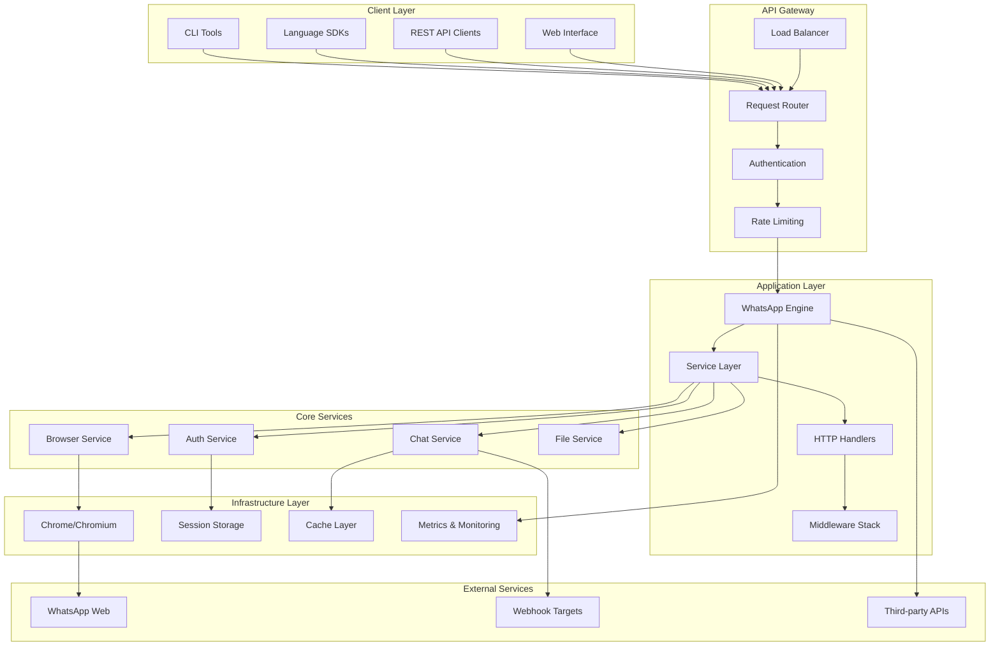
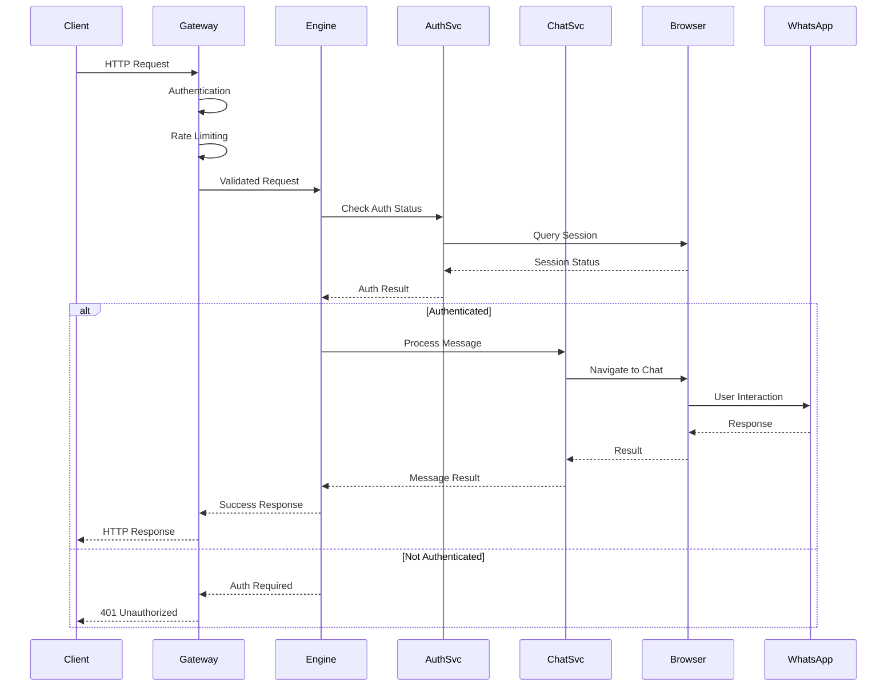
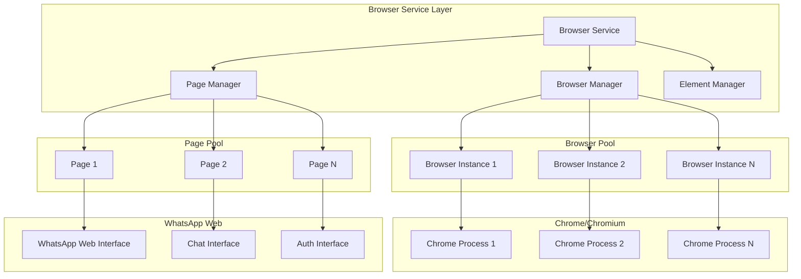

# Architecture Documentation 🏗️

This document provides a comprehensive architectural overview of WhatsApp Engine Rust, including design decisions, patterns, and implementation details.

## 📋 Table of Contents

- [System Overview](#-system-overview)
- [Architectural Principles](#-architectural-principles)
- [Component Architecture](#-component-architecture)
- [Data Flow Architecture](#-data-flow-architecture)
- [Service Layer Design](#-service-layer-design)
- [Browser Integration Architecture](#-browser-integration-architecture)
- [Authentication Architecture](#-authentication-architecture)
- [Message Processing Architecture](#-message-processing-architecture)
- [Configuration Architecture](#-configuration-architecture)
- [Error Handling Architecture](#-error-handling-architecture)
- [Scalability Architecture](#-scalability-architecture)
- [Security Architecture](#-security-architecture)
- [Deployment Architecture](#-deployment-architecture)

## 🎯 System Overview

### High-Level Architecture



### Architecture Layers

1. **Client Layer**: Various client interfaces (CLI, SDKs, REST clients)
2. **API Gateway**: Load balancing, routing, authentication, rate limiting
3. **Application Layer**: Core application logic and HTTP handling
4. **Service Layer**: Business logic services (Auth, Chat, Browser, File)
5. **Infrastructure Layer**: Browser automation, storage, caching, monitoring
6. **External Layer**: WhatsApp Web, webhooks, third-party integrations

## 🎨 Architectural Principles

### Design Principles

#### 1. Separation of Concerns
```rust
// Clear separation between layers
pub struct WhatsAppEngine {
    auth_service: Arc<dyn AuthServiceTrait>,
    chat_service: Arc<dyn ChatServiceTrait>,
    browser_service: Arc<dyn BrowserServiceTrait>,
    config: Arc<AppConfig>,
}

// Each service has a single responsibility
impl AuthServiceTrait for AuthService {
    async fn authenticate(&self) -> Result<AuthStatus>;
    async fn get_status(&self) -> Result<AuthStatus>;
    async fn logout(&self) -> Result<()>;
}
```

#### 2. Dependency Injection
```rust
// Services depend on abstractions, not concrete types
pub struct ChatService {
    browser: Arc<dyn BrowserServiceTrait>,
    auth: Arc<dyn AuthServiceTrait>,
    storage: Arc<dyn StorageServiceTrait>,
}

impl ChatService {
    pub fn new(
        browser: Arc<dyn BrowserServiceTrait>,
        auth: Arc<dyn AuthServiceTrait>,
        storage: Arc<dyn StorageServiceTrait>,
    ) -> Self {
        Self { browser, auth, storage }
    }
}
```

#### 3. Async-First Design
```rust
// All operations are async for non-blocking execution
#[async_trait]
pub trait MessageSender {
    async fn send_message(&self, to: &str, content: &str) -> Result<MessageResult>;
    async fn send_file(&self, to: &str, file: &FileAttachment) -> Result<MessageResult>;
}

// Async error handling
pub async fn send_with_retry(
    sender: &dyn MessageSender,
    to: &str,
    content: &str,
    max_retries: u32,
) -> Result<MessageResult> {
    let mut attempts = 0;
    loop {
        match sender.send_message(to, content).await {
            Ok(result) => return Ok(result),
            Err(e) if e.is_retryable() && attempts < max_retries => {
                attempts += 1;
                tokio::time::sleep(Duration::from_secs(2_u64.pow(attempts))).await;
            }
            Err(e) => return Err(e),
        }
    }
}
```

#### 4. Resource Safety
```rust
// RAII pattern for resource management
impl Drop for BrowserService {
    fn drop(&mut self) {
        // Ensure browser processes are cleaned up
        if let Some(browser) = &self.browser {
            let _ = browser.close();
        }
    }
}

// Arc for shared ownership, Weak for breaking cycles
pub struct AuthService {
    browser: Arc<BrowserService>,
    engine: Weak<WhatsAppEngine>, // Weak reference to prevent cycles
}
```

### Architectural Patterns

#### 1. Service-Oriented Architecture (SOA)
- **Microservice-like** structure within a monolith
- **Service interfaces** define contracts
- **Dependency injection** for loose coupling
- **Service registry** for discovery

#### 2. Event-Driven Architecture
```rust
// Event-driven communication between services
#[derive(Debug, Clone)]
pub enum WhatsAppEvent {
    AuthenticationStatusChanged(AuthStatus),
    MessageReceived(Message),
    BrowserConnectionLost,
    SessionExpired,
}

pub struct EventBus {
    subscribers: HashMap<String, Vec<Box<dyn EventHandler>>>,
}

#[async_trait]
pub trait EventHandler: Send + Sync {
    async fn handle_event(&self, event: &WhatsAppEvent) -> Result<()>;
}
```

#### 3. Repository Pattern
```rust
// Data access abstraction
#[async_trait]
pub trait SessionRepository {
    async fn save_session(&self, session: &SessionData) -> Result<()>;
    async fn load_session(&self, session_id: &str) -> Result<Option<SessionData>>;
    async fn delete_session(&self, session_id: &str) -> Result<()>;
}

// Multiple implementations (file, database, memory)
pub struct FileSessionRepository {
    base_path: PathBuf,
}

pub struct DatabaseSessionRepository {
    pool: DatabasePool,
}
```

#### 4. Factory Pattern
```rust
// Factory for creating configured services
pub struct ServiceFactory {
    config: Arc<AppConfig>,
}

impl ServiceFactory {
    pub async fn create_browser_service(&self) -> Result<Arc<dyn BrowserServiceTrait>> {
        let service = BrowserService::new(&self.config.browser).await?;
        Ok(Arc::new(service))
    }
    
    pub async fn create_auth_service(
        &self,
        browser: Arc<dyn BrowserServiceTrait>,
    ) -> Result<Arc<dyn AuthServiceTrait>> {
        let service = AuthService::new(browser, &self.config.auth).await?;
        Ok(Arc::new(service))
    }
}
```

## 🧩 Component Architecture

### Core Components

#### 1. WhatsApp Engine (Orchestrator)
```rust
pub struct WhatsAppEngine {
    // Core services
    auth_service: Arc<AuthService>,
    chat_service: Arc<ChatService>,
    browser_service: Arc<BrowserService>,
    file_service: Arc<FileService>,
    
    // Infrastructure
    event_bus: Arc<EventBus>,
    metrics: Arc<MetricsCollector>,
    config: Arc<AppConfig>,
    
    // State management
    state: Arc<Mutex<EngineState>>,
}

#[derive(Debug, Clone)]
pub enum EngineState {
    Initializing,
    Ready,
    Authenticated,
    Error(String),
    Shutdown,
}
```

#### 2. Service Registry
```rust
pub struct ServiceRegistry {
    services: HashMap<String, Box<dyn Any + Send + Sync>>,
    dependencies: HashMap<String, Vec<String>>,
}

impl ServiceRegistry {
    pub fn register<T: Any + Send + Sync>(&mut self, name: &str, service: T) {
        self.services.insert(name.to_string(), Box::new(service));
    }
    
    pub fn get<T: Any + Send + Sync>(&self, name: &str) -> Option<&T> {
        self.services.get(name)
            .and_then(|s| s.downcast_ref::<T>())
    }
    
    pub async fn initialize_all(&self) -> Result<()> {
        // Topological sort based on dependencies
        let order = self.resolve_dependencies()?;
        
        for service_name in order {
            self.initialize_service(&service_name).await?;
        }
        
        Ok(())
    }
}
```

### Component Lifecycle

#### 1. Initialization Phase
```rust
impl WhatsAppEngine {
    pub async fn new(config: AppConfig) -> Result<Self> {
        // Phase 1: Create service registry
        let mut registry = ServiceRegistry::new();
        
        // Phase 2: Register services with dependencies
        registry.register_with_deps("browser", BrowserService::new, vec![]);
        registry.register_with_deps("auth", AuthService::new, vec!["browser"]);
        registry.register_with_deps("chat", ChatService::new, vec!["browser", "auth"]);
        registry.register_with_deps("file", FileService::new, vec!["browser"]);
        
        // Phase 3: Initialize in dependency order
        registry.initialize_all().await?;
        
        // Phase 4: Create engine with initialized services
        let engine = Self {
            auth_service: registry.get("auth").unwrap(),
            chat_service: registry.get("chat").unwrap(),
            browser_service: registry.get("browser").unwrap(),
            file_service: registry.get("file").unwrap(),
            // ... other fields
        };
        
        // Phase 5: Start background tasks
        engine.start_background_tasks().await?;
        
        Ok(engine)
    }
}
```

#### 2. Runtime Phase
```rust
impl WhatsAppEngine {
    async fn start_background_tasks(&self) -> Result<()> {
        // Health monitoring
        self.start_health_monitor().await?;
        
        // Metrics collection
        self.start_metrics_collector().await?;
        
        // Session persistence
        self.start_session_persister().await?;
        
        // Browser maintenance
        self.start_browser_maintenance().await?;
        
        Ok(())
    }
    
    async fn start_health_monitor(&self) -> Result<()> {
        let auth_service = self.auth_service.clone();
        let browser_service = self.browser_service.clone();
        
        tokio::spawn(async move {
            let mut interval = tokio::time::interval(Duration::from_secs(30));
            
            loop {
                interval.tick().await;
                
                // Check service health
                if let Err(e) = auth_service.health_check().await {
                    tracing::warn!("Auth service health check failed: {}", e);
                }
                
                if let Err(e) = browser_service.health_check().await {
                    tracing::warn!("Browser service health check failed: {}", e);
                }
            }
        });
        
        Ok(())
    }
}
```

#### 3. Shutdown Phase
```rust
impl WhatsAppEngine {
    pub async fn shutdown(&self) -> Result<()> {
        tracing::info!("Starting graceful shutdown");
        
        // Phase 1: Stop accepting new requests
        self.set_state(EngineState::Shutdown).await;
        
        // Phase 2: Wait for in-flight operations
        self.wait_for_completion(Duration::from_secs(30)).await?;
        
        // Phase 3: Shutdown services in reverse dependency order
        self.file_service.shutdown().await?;
        self.chat_service.shutdown().await?;
        self.auth_service.shutdown().await?;
        self.browser_service.shutdown().await?;
        
        // Phase 4: Cleanup resources
        self.cleanup_resources().await?;
        
        tracing::info!("Graceful shutdown completed");
        Ok(())
    }
}
```

## 🔄 Data Flow Architecture

### Request Processing Flow



### Message Flow Architecture

```rust
// Message processing pipeline
pub struct MessagePipeline {
    validators: Vec<Box<dyn MessageValidator>>,
    processors: Vec<Box<dyn MessageProcessor>>,
    senders: Vec<Box<dyn MessageSender>>,
}

#[async_trait]
pub trait MessageValidator {
    async fn validate(&self, message: &MessageRequest) -> Result<()>;
}

#[async_trait]
pub trait MessageProcessor {
    async fn process(&self, message: &mut MessageRequest) -> Result<()>;
}

#[async_trait]
pub trait MessageSender {
    async fn send(&self, message: &MessageRequest) -> Result<MessageResult>;
}

impl MessagePipeline {
    pub async fn process_message(&self, mut message: MessageRequest) -> Result<MessageResult> {
        // Validation phase
        for validator in &self.validators {
            validator.validate(&message).await?;
        }
        
        // Processing phase
        for processor in &self.processors {
            processor.process(&mut message).await?;
        }
        
        // Sending phase
        for sender in &self.senders {
            match sender.send(&message).await {
                Ok(result) => return Ok(result),
                Err(e) if e.is_retryable() => continue,
                Err(e) => return Err(e),
            }
        }
        
        Err(WhatsAppError::Internal("All senders failed".to_string()))
    }
}
```

### Event Flow Architecture

```rust
// Event-driven architecture for loose coupling
pub struct EventBus {
    channels: HashMap<String, mpsc::UnboundedSender<WhatsAppEvent>>,
    handlers: HashMap<String, Vec<Arc<dyn EventHandler>>>,
}

impl EventBus {
    pub async fn publish(&self, event: WhatsAppEvent) -> Result<()> {
        let event_type = event.event_type();
        
        // Send to channels
        if let Some(sender) = self.channels.get(&event_type) {
            sender.send(event.clone())?;
        }
        
        // Send to handlers
        if let Some(handlers) = self.handlers.get(&event_type) {
            let futures: Vec<_> = handlers.iter()
                .map(|handler| handler.handle_event(&event))
                .collect();
            
            futures::future::try_join_all(futures).await?;
        }
        
        Ok(())
    }
    
    pub fn subscribe<H: EventHandler + 'static>(&mut self, event_type: &str, handler: H) {
        self.handlers
            .entry(event_type.to_string())
            .or_insert_with(Vec::new)
            .push(Arc::new(handler));
    }
}

// Example event handlers
struct AuthStatusHandler {
    chat_service: Weak<ChatService>,
}

#[async_trait]
impl EventHandler for AuthStatusHandler {
    async fn handle_event(&self, event: &WhatsAppEvent) -> Result<()> {
        match event {
            WhatsAppEvent::AuthenticationStatusChanged(status) => {
                if let Some(chat_service) = self.chat_service.upgrade() {
                    chat_service.update_auth_status(status).await?;
                }
            }
            _ => {}
        }
        Ok(())
    }
}
```

## 🛠️ Service Layer Design

### Service Interface Design

```rust
// Base service trait with common functionality
#[async_trait]
pub trait Service: Send + Sync {
    async fn initialize(&self) -> Result<()>;
    async fn health_check(&self) -> Result<HealthStatus>;
    async fn shutdown(&self) -> Result<()>;
    fn name(&self) -> &str;
}

// Specialized service traits
#[async_trait]
pub trait AuthServiceTrait: Service {
    async fn authenticate_qr(&self) -> Result<QrCode>;
    async fn authenticate_phone(&self, phone: &str) -> Result<PhoneAuthResult>;
    async fn get_auth_status(&self) -> Result<AuthStatus>;
    async fn logout(&self) -> Result<()>;
}

#[async_trait]
pub trait ChatServiceTrait: Service {
    async fn send_message(&self, to: &str, content: &str) -> Result<MessageResult>;
    async fn send_file(&self, to: &str, file: &FileAttachment) -> Result<MessageResult>;
    async fn get_contacts(&self) -> Result<Vec<Contact>>;
    async fn get_chats(&self) -> Result<Vec<Chat>>;
}

#[async_trait]
pub trait BrowserServiceTrait: Service {
    async fn navigate(&self, url: &str) -> Result<()>;
    async fn execute_script(&self, script: &str) -> Result<serde_json::Value>;
    async fn take_screenshot(&self) -> Result<Vec<u8>>;
    async fn get_page_source(&self) -> Result<String>;
}
```

### Service Implementation Pattern

```rust
pub struct AuthService {
    // Dependencies
    browser: Arc<dyn BrowserServiceTrait>,
    storage: Arc<dyn StorageServiceTrait>,
    event_bus: Arc<EventBus>,
    
    // Configuration
    config: AuthConfig,
    
    // State
    state: Arc<Mutex<AuthState>>,
    
    // Background tasks
    tasks: Arc<Mutex<Vec<JoinHandle<()>>>>,
}

impl AuthService {
    pub fn new(
        browser: Arc<dyn BrowserServiceTrait>,
        storage: Arc<dyn StorageServiceTrait>,
        event_bus: Arc<EventBus>,
        config: AuthConfig,
    ) -> Self {
        Self {
            browser,
            storage,
            event_bus,
            config,
            state: Arc::new(Mutex::new(AuthState::Uninitialized)),
            tasks: Arc::new(Mutex::new(Vec::new())),
        }
    }
}

#[async_trait]
impl Service for AuthService {
    async fn initialize(&self) -> Result<()> {
        let mut state = self.state.lock().await;
        *state = AuthState::Initializing;
        
        // Initialize browser session
        self.browser.navigate("https://web.whatsapp.com").await?;
        
        // Load existing session if available
        if let Ok(Some(session)) = self.storage.load_session("default").await {
            self.restore_session(session).await?;
        }
        
        // Start background tasks
        self.start_session_monitor().await?;
        
        *state = AuthState::Ready;
        
        self.event_bus.publish(WhatsAppEvent::ServiceInitialized {
            service: "auth".to_string(),
        }).await?;
        
        Ok(())
    }
    
    async fn health_check(&self) -> Result<HealthStatus> {
        let state = self.state.lock().await;
        let browser_healthy = self.browser.health_check().await.is_ok();
        let storage_healthy = self.storage.health_check().await.is_ok();
        
        Ok(HealthStatus {
            healthy: matches!(*state, AuthState::Ready | AuthState::Authenticated) 
                     && browser_healthy && storage_healthy,
            details: serde_json::json!({
                "state": format!("{:?}", *state),
                "browser_healthy": browser_healthy,
                "storage_healthy": storage_healthy,
            }),
        })
    }
    
    async fn shutdown(&self) -> Result<()> {
        let mut state = self.state.lock().await;
        *state = AuthState::ShuttingDown;
        
        // Cancel background tasks
        let mut tasks = self.tasks.lock().await;
        for task in tasks.drain(..) {
            task.abort();
        }
        
        // Save current session
        if let Ok(session) = self.get_current_session().await {
            self.storage.save_session("default", &session).await?;
        }
        
        *state = AuthState::Shutdown;
        Ok(())
    }
    
    fn name(&self) -> &str {
        "auth"
    }
}
```

### Service Composition

```rust
// Service composition for complex operations
pub struct CompositeOperationService {
    auth: Arc<dyn AuthServiceTrait>,
    chat: Arc<dyn ChatServiceTrait>,
    file: Arc<dyn FileServiceTrait>,
}

impl CompositeOperationService {
    pub async fn send_message_with_retry(
        &self,
        to: &str,
        content: &str,
        max_retries: u32,
    ) -> Result<MessageResult> {
        // Check authentication first
        let auth_status = self.auth.get_auth_status().await?;
        if !auth_status.is_authenticated {
            return Err(WhatsAppError::Authentication("Not authenticated".to_string()));
        }
        
        // Attempt to send message with retry logic
        let mut attempts = 0;
        loop {
            match self.chat.send_message(to, content).await {
                Ok(result) => return Ok(result),
                Err(WhatsAppError::Authentication(_)) => {
                    // Re-authenticate and retry
                    self.auth.authenticate_qr().await?;
                    attempts += 1;
                }
                Err(e) if e.is_retryable() && attempts < max_retries => {
                    attempts += 1;
                    tokio::time::sleep(Duration::from_secs(2_u64.pow(attempts))).await;
                }
                Err(e) => return Err(e),
            }
        }
    }
}
```

## 🌐 Browser Integration Architecture

### Browser Service Architecture



### Browser Pool Management

```rust
pub struct BrowserPool {
    browsers: Vec<Arc<Browser>>,
    available: Arc<Mutex<VecDeque<Arc<Browser>>>>,
    semaphore: Arc<Semaphore>,
    config: BrowserConfig,
}

impl BrowserPool {
    pub async fn new(size: usize, config: BrowserConfig) -> Result<Self> {
        let mut browsers = Vec::with_capacity(size);
        let mut available = VecDeque::with_capacity(size);
        
        for i in 0..size {
            let browser = Self::create_browser(&config, i).await?;
            let browser = Arc::new(browser);
            browsers.push(browser.clone());
            available.push_back(browser);
        }
        
        Ok(Self {
            browsers,
            available: Arc::new(Mutex::new(available)),
            semaphore: Arc::new(Semaphore::new(size)),
            config,
        })
    }
    
    pub async fn acquire(&self) -> Result<BrowserGuard> {
        let _permit = self.semaphore.acquire().await?;
        
        let browser = {
            let mut available = self.available.lock().await;
            available.pop_front()
                .ok_or_else(|| WhatsAppError::Internal("No browsers available".to_string()))?
        };
        
        // Health check before returning
        if !self.is_browser_healthy(&browser).await? {
            // Replace unhealthy browser
            let new_browser = Self::create_browser(&self.config, 0).await?;
            let new_browser = Arc::new(new_browser);
            
            Ok(BrowserGuard {
                browser: new_browser,
                pool: self.available.clone(),
                _permit,
            })
        } else {
            Ok(BrowserGuard {
                browser,
                pool: self.available.clone(),
                _permit,
            })
        }
    }
    
    async fn create_browser(config: &BrowserConfig, instance_id: usize) -> Result<Browser> {
        let launch_options = LaunchOptions::default()
            .headless(config.headless)
            .sandbox(false)
            .args(config.args.clone())
            .user_data_dir(format!("/tmp/chrome-{}", instance_id));
        
        let browser = Browser::launch(launch_options).await?;
        
        // Apply optimizations
        let page = browser.new_page("about:blank").await?;
        Self::optimize_page(&page).await?;
        
        Ok(browser)
    }
    
    async fn optimize_page(page: &Page) -> Result<()> {
        // Disable images for faster loading
        page.execute(r#"
            const style = document.createElement('style');
            style.textContent = 'img { display: none !important; }';
            document.head.appendChild(style);
        "#).await?;
        
        // Disable animations
        page.execute(r#"
            const style = document.createElement('style');
            style.textContent = '*, *::before, *::after { 
                animation-duration: 0.01ms !important; 
                animation-delay: -0.01ms !important; 
                transition-duration: 0.01ms !important; 
            }';
            document.head.appendChild(style);
        "#).await?;
        
        Ok(())
    }
}

pub struct BrowserGuard {
    browser: Arc<Browser>,
    pool: Arc<Mutex<VecDeque<Arc<Browser>>>>,
    _permit: SemaphorePermit<'static>,
}

impl Drop for BrowserGuard {
    fn drop(&mut self) {
        let browser = self.browser.clone();
        let pool = self.pool.clone();
        
        tokio::spawn(async move {
            let mut available = pool.lock().await;
            available.push_back(browser);
        });
    }
}

impl Deref for BrowserGuard {
    type Target = Browser;
    
    fn deref(&self) -> &Self::Target {
        &self.browser
    }
}
```

### Element Location Strategy

```rust
pub struct ElementLocator {
    strategies: Vec<Box<dyn LocationStrategy>>,
    cache: Arc<Mutex<HashMap<String, CachedElement>>>,
}

#[async_trait]
pub trait LocationStrategy: Send + Sync {
    async fn locate(&self, page: &Page, selector: &str) -> Result<Element>;
    fn priority(&self) -> u8; // Higher number = higher priority
}

// CSS Selector Strategy
pub struct CssSelectorStrategy;

#[async_trait]
impl LocationStrategy for CssSelectorStrategy {
    async fn locate(&self, page: &Page, selector: &str) -> Result<Element> {
        page.find_element(selector).await
            .map_err(|e| WhatsAppError::BrowserNavigation(format!("CSS selector failed: {}", e)))
    }
    
    fn priority(&self) -> u8 { 100 }
}

// XPath Strategy
pub struct XPathStrategy;

#[async_trait]
impl LocationStrategy for XPathStrategy {
    async fn locate(&self, page: &Page, selector: &str) -> Result<Element> {
        let xpath = self.css_to_xpath(selector);
        page.find_element_by_xpath(&xpath).await
            .map_err(|e| WhatsAppError::BrowserNavigation(format!("XPath failed: {}", e)))
    }
    
    fn priority(&self) -> u8 { 80 }
}

// Text Content Strategy
pub struct TextContentStrategy;

#[async_trait]
impl LocationStrategy for TextContentStrategy {
    async fn locate(&self, page: &Page, text: &str) -> Result<Element> {
        let script = format!(r#"
            Array.from(document.querySelectorAll('*'))
                .find(el => el.textContent.trim() === '{}')
        "#, text);
        
        let element = page.evaluate(&script).await?;
        // Convert JSValue to Element
        todo!("Implement JSValue to Element conversion")
    }
    
    fn priority(&self) -> u8 { 60 }
}

impl ElementLocator {
    pub fn new() -> Self {
        let mut strategies: Vec<Box<dyn LocationStrategy>> = vec![
            Box::new(CssSelectorStrategy),
            Box::new(XPathStrategy),
            Box::new(TextContentStrategy),
        ];
        
        // Sort by priority (highest first)
        strategies.sort_by(|a, b| b.priority().cmp(&a.priority()));
        
        Self {
            strategies,
            cache: Arc::new(Mutex::new(HashMap::new())),
        }
    }
    
    pub async fn locate_element(&self, page: &Page, selector: &str) -> Result<Element> {
        // Check cache first
        let cache_key = format!("{}-{}", page.url().await?, selector);
        {
            let cache = self.cache.lock().await;
            if let Some(cached) = cache.get(&cache_key) {
                if !cached.is_expired() {
                    if let Ok(element) = cached.try_get_element().await {
                        return Ok(element);
                    }
                }
            }
        }
        
        // Try strategies in order of priority
        for strategy in &self.strategies {
            match strategy.locate(page, selector).await {
                Ok(element) => {
                    // Cache successful result
                    let mut cache = self.cache.lock().await;
                    cache.insert(cache_key, CachedElement::new(element.clone()));
                    return Ok(element);
                }
                Err(_) => continue, // Try next strategy
            }
        }
        
        Err(WhatsAppError::BrowserNavigation(
            format!("Element not found with any strategy: {}", selector)
        ))
    }
}

struct CachedElement {
    element_id: String,
    created_at: Instant,
    ttl: Duration,
}

impl CachedElement {
    fn new(element: Element) -> Self {
        Self {
            element_id: element.remote_object_id().to_string(),
            created_at: Instant::now(),
            ttl: Duration::from_secs(30), // Cache for 30 seconds
        }
    }
    
    fn is_expired(&self) -> bool {
        self.created_at.elapsed() > self.ttl
    }
    
    async fn try_get_element(&self) -> Result<Element> {
        // Try to get element by cached ID
        // This would require browser API support
        todo!("Implement element retrieval by ID")
    }
}
```

This comprehensive architecture documentation provides detailed insights into the design decisions, patterns, and implementation strategies used in WhatsApp Engine Rust. The architecture is designed for scalability, maintainability, and performance while maintaining clean separation of concerns and proper error handling.
