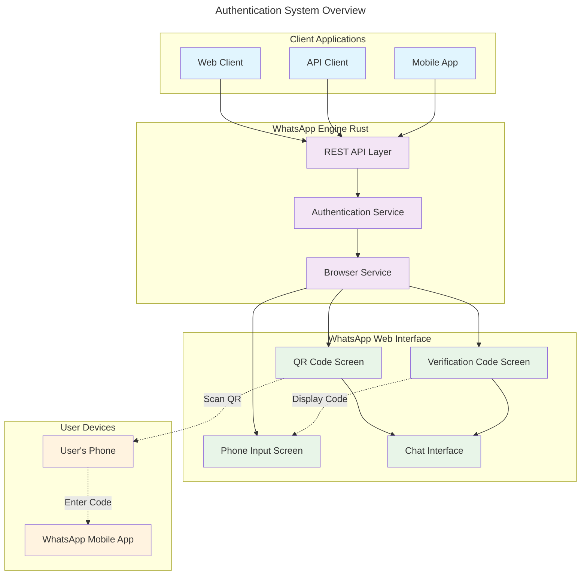
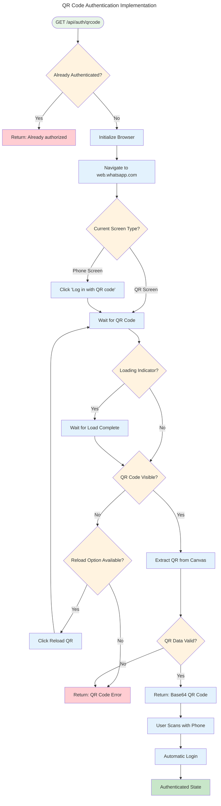
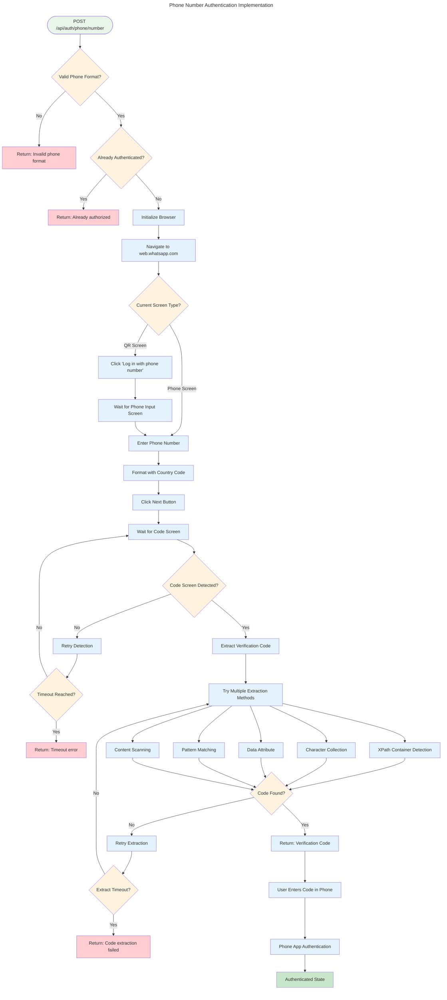

# WhatsApp Authentication Flow Documentation

This document provides a comprehensive overview of the WhatsApp Web authentication mechanisms implemented in the WhatsApp Engine Rust project.

## Overview

The WhatsApp Engine Rust supports two primary authentication methods:

1. **QR Code Authentication** - Traditional method requiring phone scanning
2. **Phone Number Authentication** - Advanced method with verification code display

Both methods leverage WhatsApp Web's authentication system but provide different user experiences and integration patterns.

## Authentication Architecture



## QR Code Authentication

### Flow Description

QR Code authentication is the traditional WhatsApp Web authentication method where users scan a QR code with their mobile device.

### Implementation Details



### Key Features

- **Instant Authentication**: Once QR is scanned, authentication is immediate
- **No Phone Number Required**: Works without providing phone number to the API
- **Universal Compatibility**: Works with all WhatsApp accounts
- **Session Persistence**: Maintains session across browser restarts

### Code Example

```rust
// Extract QR code from WhatsApp Web canvas
async fn extract_qr_code(&self, page: &Page) -> Result<String> {
    // Wait for QR code canvas to be visible
    page.find_element("canvas").await?;

    // Extract QR code from canvas
    let canvas_result = page.evaluate(
        "document.getElementsByTagName('canvas')[0].toDataURL('image/png');"
    ).await?;
    
    let canvas_string = match canvas_result.into_value()? {
        serde_json::Value::String(data) => data,
        _ => return Err(anyhow::anyhow!("Failed to get QR code canvas data")),
    };

    // Return base64 encoded PNG data
    Ok(canvas_string.split(',').nth(1).unwrap_or("").to_string())
}
```

## Phone Number Authentication

### Flow Description

Phone Number authentication is an advanced method where the system handles phone number input and displays a verification code that users enter in their mobile WhatsApp app.

### Implementation Details



### Key Features

- **Programmatic Phone Input**: API handles phone number entry automatically
- **Advanced Code Detection**: Multiple detection methods for reliability
- **Real-time Code Extraction**: Extracts verification code from DOM
- **Robust Error Handling**: Comprehensive timeout and retry mechanisms

### Code Extraction Methods

The system employs multiple sophisticated methods to extract the verification code:

#### Method 1: XPath Container Detection
```javascript
// Look for code container following "Enter code on phone" text
const codeContainer = document.evaluate(
    "//div[contains(text(), 'Enter code on phone')]/following-sibling::div",
    document,
    null,
    XPathResult.FIRST_ORDERED_NODE_TYPE,
    null
).singleNodeValue;
```

#### Method 2: Character-by-Character Collection
```javascript
// Collect individual characters from separate div elements
const children = Array.from(codeContainer.querySelectorAll('div'));
let codeChars = [];

for (let child of children) {
    const text = child.textContent?.trim();
    if (text && text.length <= 2 && text.match(/[A-Z0-9-]/)) {
        codeChars.push(text);
    }
}
```

#### Method 3: Data Attribute Extraction
```javascript
// Look for data-link-code attribute
const linkCodeElement = document.querySelector('[data-link-code]');
if (linkCodeElement) {
    const linkCode = linkCodeElement.getAttribute('data-link-code');
    return linkCode;
}
```

#### Method 4: Pattern Matching
```javascript
// Search for code patterns in page content
const bodyText = document.body.textContent || '';
const codeMatch = bodyText.match(/\b[A-Z0-9]{3,4}[-][A-Z0-9]{3,4}\b/);
if (codeMatch) {
    return codeMatch[0];
}
```

#### Method 5: Content Scanning
```javascript
// Fallback pattern matching for alphanumeric codes
const simpleCodeMatch = bodyText.match(/\b[A-Z0-9]{6,9}\b/);
if (simpleCodeMatch && !simpleCodeMatch[0].match(/^\d+$/)) {
    return simpleCodeMatch[0];
}
```

## Screen Detection Logic

### Multiple Detection Strategies

The authentication service uses multiple strategies to detect different WhatsApp Web screens:

```rust
// Check multiple possible selectors for the code screen
let has_code_label = page.find_element("[aria-label='Enter code on phone:']").await.is_ok();
let has_code_text = page.find_element("text='Enter code on phone'").await.is_ok();
let has_link_device_text = page.find_element("text='Link a device'").await.is_ok();
let has_code_element = page.find_element("[aria-details='link-device-phone-number-code-screen-instructions']").await.is_ok();

// Additional checks for code display patterns
let has_code_container = page.find_element("div[data-link-code]").await.is_ok();
let has_verification_text = page.find_element("text='verification'").await.is_ok();
let has_digits_pattern = page.find_element("div > div > div").await.is_ok() && {
    let content = page.content().await.unwrap_or_default();
    content.contains("Verify") || content.contains("code") || content.contains("device")
};

// Check URL change that might indicate we're on code screen
let current_url = page.url().await.unwrap_or_default().unwrap_or_default();
let url_indicates_code_screen = current_url.contains("code") || current_url.contains("link");
```

## Error Handling and Recovery

### Timeout Management

The system implements comprehensive timeout management:

- **Browser Initialization**: 30 seconds
- **Page Navigation**: 15 seconds  
- **Screen Detection**: 45 seconds
- **Code Extraction**: 15 seconds

### Retry Mechanisms

- **Phone Number Submission**: Up to 5 retry attempts
- **Code Screen Detection**: 90 attempts with 500ms intervals
- **Code Extraction**: 30 attempts with 500ms intervals

### Error Categories

1. **Browser Errors**: Chrome launch failures, connection issues
2. **Navigation Errors**: Page load failures, timeout issues
3. **Input Errors**: Invalid phone formats, submission failures
4. **Detection Errors**: Screen detection failures, element not found
5. **Extraction Errors**: Code extraction failures, timeout issues

## Configuration Options

### Browser Configuration

```toml
[browser]
headless = false           # Run browser in headless mode
timeout = 30000           # Browser operation timeout (ms)
user_agent = "Mozilla/5.0 (X11; Linux x86_64) AppleWebKit/537.36"
args = [                  # Additional Chrome arguments
    "--no-sandbox",
    "--disable-setuid-sandbox",
    "--disable-dev-shm-usage"
]
```

### Authentication Configuration

```toml
[auth]
api_token = "your-secure-token-here"
session_timeout = 3600    # Session timeout in seconds

[whatsapp]
base_url = "https://web.whatsapp.com"
retry_attempts = 3        # Number of retry attempts
retry_delay = 1000       # Delay between retries (ms)
```

## Performance Considerations

### Memory Usage

- **Browser Instances**: Each session uses ~150-200MB RAM
- **Page Objects**: Minimal memory footprint with efficient cleanup
- **Unique Profiles**: UUID-based profiles prevent singleton conflicts

### Connection Management

- **Browser Pooling**: Efficient reuse of browser instances
- **Page Persistence**: WhatsApp pages persist across requests
- **Cleanup Logic**: Automatic cleanup of temporary directories

### Optimization Strategies

- **Lazy Initialization**: Browser launched only when needed
- **Connection Reuse**: Same page instance for multiple operations
- **Resource Cleanup**: Automatic cleanup on service shutdown

## Security Considerations

### Process Isolation

- **Unique User Data Directories**: Each instance uses UUID-based directories
- **Process Sandboxing**: Chrome runs with security restrictions
- **Network Isolation**: Browser restricted to WhatsApp Web domain

### Data Protection

- **Temporary Storage**: All data stored in temporary directories
- **Automatic Cleanup**: Sensitive data cleaned up after use
- **No Persistent Storage**: No long-term storage of authentication data

### API Security

- **Token Authentication**: Bearer token required for all endpoints
- **Input Validation**: Comprehensive validation of all inputs
- **Rate Limiting**: Protection against abuse and overuse

## Monitoring and Debugging

### Logging Levels

```rust
// Authentication flow logging
debug!("Page state - QR login: {}, Phone login: {}, Code screen: {}", 
       has_qr_login, has_phone_login, has_code_screen);

info!("Phone authentication code found via character extraction: {}", formatted_code);

error!("Timeout waiting for code input screen - phone number may be invalid");
```

### Debug Mode

For debugging authentication issues:

```bash
# Enable debug logging
export RUST_LOG=debug

# Run with visible browser
# Edit config/app.toml
[browser]
headless = false
```

### Health Checks

```bash
# Check authentication status
curl -H "Authorization: Bearer YOUR_TOKEN" \
     http://localhost:3000/api/auth/status

# Response indicates current state
{
  "authorized": true,
  "sender_id": "1234567890@c.us"
}
```

## Troubleshooting Guide

### Common Issues

1. **Phone Format Issues**: Ensure proper international format (+1234567890)
2. **Browser Launch Failures**: Check Chrome installation and dependencies
3. **Timeout Errors**: Verify network connectivity and phone number validity
4. **Code Extraction Failures**: Check for WhatsApp Web UI changes

### Diagnostic Commands

```bash
# Test browser initialization
cargo test browser_tests

# Test authentication flow
./test_phone_auth.sh +1234567890

# Check logs for detailed error information
tail -f logs/app.log
```

## Future Enhancements

### Planned Features

- **Multi-factor Authentication**: Support for additional security layers
- **Session Management**: Advanced session persistence and recovery
- **Load Balancing**: Support for multiple browser instances
- **Real-time Monitoring**: Enhanced metrics and monitoring capabilities

### Performance Improvements

- **Caching Strategy**: Intelligent caching of page elements
- **Parallel Processing**: Concurrent authentication requests
- **Resource Optimization**: Reduced memory and CPU usage
- **Network Optimization**: Minimized network traffic

## Conclusion

The WhatsApp Engine Rust authentication system provides a robust, scalable solution for both QR code and phone number authentication. The implementation prioritizes reliability, security, and performance while maintaining compatibility with WhatsApp Web's evolving interface.

The dual authentication approach offers flexibility for different use cases:
- **QR Code**: Ideal for quick testing and development
- **Phone Number**: Perfect for production automation and integration

The comprehensive error handling, retry mechanisms, and debugging capabilities ensure reliable operation in production environments.
