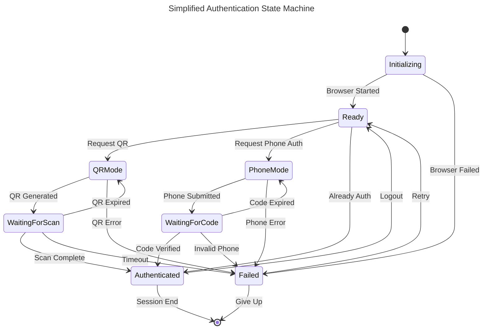
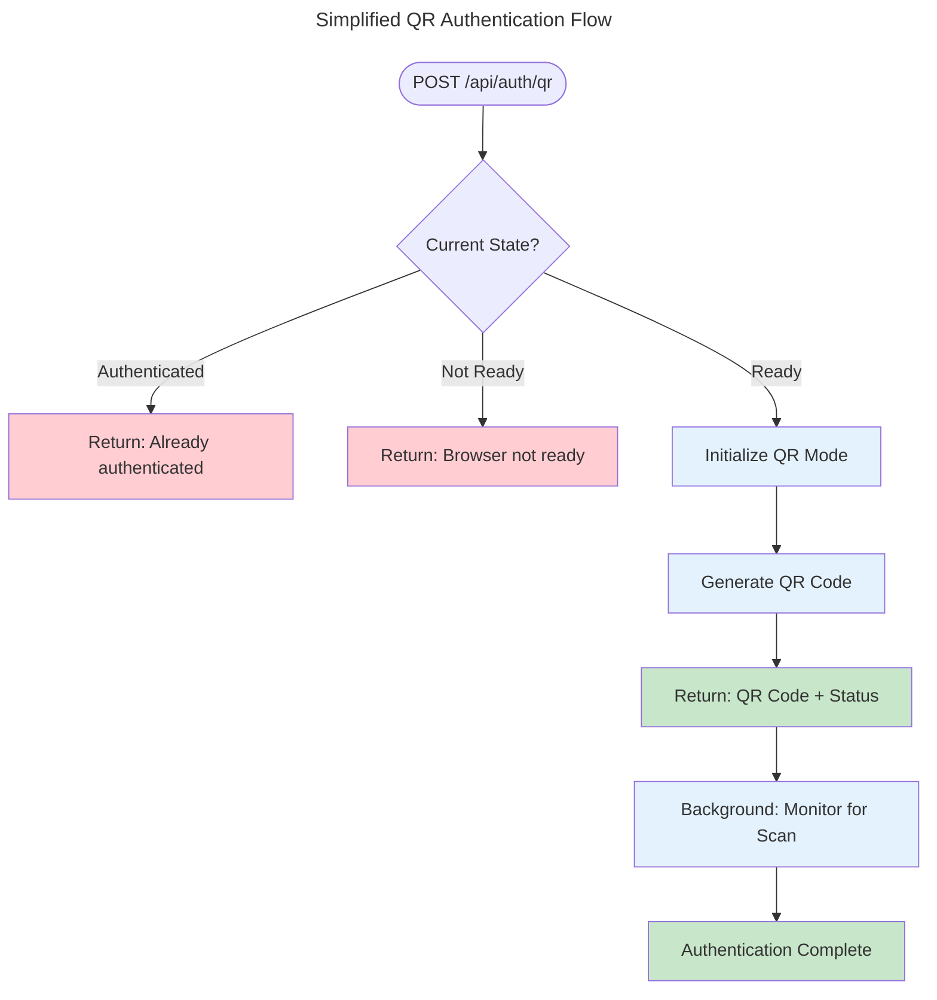
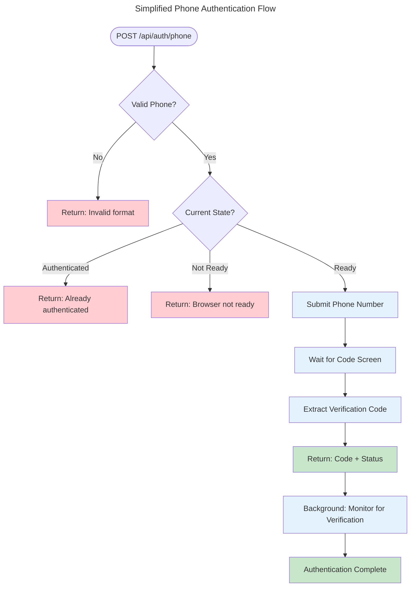

# Authentication Flow Improvements and Simplifications

## Executive Summary

This document proposes significant improvements to the WhatsApp Engine Rust authentication system to simplify workflows, reduce complexity, and enhance reliability. The current implementation, while functional, can be streamlined for better maintainability and user experience.

## Current Issues and Pain Points

### 1. **Complex Flow Diagrams**
- Current Mermaid diagrams are overly complex with too many decision points
- Multiple nested conditions make debugging difficult
- Flow charts are hard to follow and understand

### 2. **Redundant Checks and Operations**
- Multiple timeout mechanisms scattered throughout the code
- Repetitive screen detection logic
- Excessive retry attempts with similar functionality

### 3. **Configuration Complexity**
- Multiple timeout settings in different parts of the system
- Complex browser configuration with many arguments
- Scattered configuration validation

### 4. **Error Handling Inconsistencies**
- Different error types for similar scenarios
- Inconsistent retry mechanisms
- Complex error message formatting

## Proposed Improvements

### 1. Unified Authentication State Machine

Replace the current complex flow with a simplified state machine approach:



### 2. Simplified API Workflow

#### Current API Endpoints (Complex)
```
GET  /api/auth/status
GET  /api/auth/qrcode
POST /api/auth/phone/{phone_number}
POST /api/auth/logout
```

#### Proposed Unified API (Simplified)
```
GET    /api/auth                    # Get current status
POST   /api/auth/qr                 # Start QR authentication
POST   /api/auth/phone              # Start phone authentication
DELETE /api/auth                    # Logout
```

#### API Design Rationale

The proposed API eliminates the need for a separate "switch" endpoint because:

1. **Both methods achieve the same goal**: Both QR and phone authentication lead to the same authenticated state
2. **Natural switching**: Users can simply call the desired authentication method directly
3. **Stateless design**: Each authentication attempt is independent and self-contained
4. **Simplified client logic**: Clients don't need to manage authentication mode switching

If a user wants to switch from QR to phone authentication (or vice versa), they simply call the appropriate endpoint directly.

### 3. Streamlined Flow Diagrams

#### Proposed QR Authentication Flow



#### Proposed Phone Authentication Flow



### 4. Unified Configuration Structure

#### Proposed Configuration Simplification

```rust
// Simplified configuration with sensible defaults
#[derive(Debug, Clone, Deserialize, Serialize)]
pub struct AuthConfig {
    pub api_token: String,
    pub session_timeout_minutes: u32,  // Unified timeout
    pub retry_attempts: u8,            // Unified retry count
    pub operation_timeout_ms: u64,     // Single timeout for all operations
}

#[derive(Debug, Clone, Deserialize, Serialize)]
pub struct BrowserConfig {
    pub headless: bool,
    pub timeout_ms: u64,               // Single browser timeout
    pub user_data_dir: Option<String>, // Optional custom directory
}

impl Default for AuthConfig {
    fn default() -> Self {
        Self {
            api_token: "change-this-secure-token".to_string(),
            session_timeout_minutes: 60,
            retry_attempts: 3,
            operation_timeout_ms: 30000,
        }
    }
}
```

### 5. Improved Error Handling

#### Proposed Error Types

```rust
#[derive(Debug, Clone, Serialize, Deserialize)]
pub enum AuthError {
    BrowserNotReady,
    AlreadyAuthenticated,
    InvalidPhoneNumber,
    QRGenerationFailed,
    CodeExtractionFailed,
    AuthenticationTimeout,
    NetworkError,
    UnknownError(String),
}

#[derive(Debug, Serialize, Deserialize)]
pub struct AuthResponse {
    pub status: AuthStatus,
    pub data: Option<AuthData>,
    pub error: Option<AuthError>,
    pub retry_after_ms: Option<u64>,
}

#[derive(Debug, Serialize, Deserialize)]
pub enum AuthStatus {
    Ready,
    InProgress,
    Authenticated,
    Failed,
}

#[derive(Debug, Serialize, Deserialize)]
pub enum AuthData {
    QRCode(String),
    PhoneCode(String),
    Session { sender_id: String },
}
```

### 6. Code Simplification Proposals

#### A. Unified Screen Detection

```rust
// Current: Multiple detection methods scattered across code
// Proposed: Single detection service

pub struct ScreenDetector {
    selectors: HashMap<ScreenType, Vec<&'static str>>,
}

#[derive(Debug, PartialEq)]
pub enum ScreenType {
    QRCode,
    PhoneEntry,
    CodeEntry,
    Authenticated,
    Loading,
}

impl ScreenDetector {
    pub async fn detect_screen(&self, page: &Page) -> Result<ScreenType> {
        // Single method with prioritized detection logic
        for (screen_type, selectors) in &self.selectors {
            for selector in selectors {
                if page.find_element(selector).await.is_ok() {
                    return Ok(*screen_type);
                }
            }
        }
        Ok(ScreenType::Loading)
    }
}
```

#### B. Unified Timeout Management

```rust
// Current: Multiple timeout configurations
// Proposed: Single timeout manager

pub struct TimeoutManager {
    operation_timeout: Duration,
    retry_attempts: u8,
}

impl TimeoutManager {
    pub async fn with_timeout<F, T>(&self, operation: F) -> Result<T>
    where
        F: Future<Output = Result<T>>,
    {
        tokio::time::timeout(self.operation_timeout, operation)
            .await
            .map_err(|_| AuthError::AuthenticationTimeout)?
    }
    
    pub async fn with_retry<F, T>(&self, mut operation: F) -> Result<T>
    where
        F: FnMut() -> Pin<Box<dyn Future<Output = Result<T>>>>,
    {
        for attempt in 1..=self.retry_attempts {
            match self.with_timeout(operation()).await {
                Ok(result) => return Ok(result),
                Err(e) if attempt == self.retry_attempts => return Err(e),
                Err(_) => {
                    tokio::time::sleep(Duration::from_millis(1000 * attempt as u64)).await;
                }
            }
        }
        unreachable!()
    }
}
```

#### C. Simplified Authentication Service

```rust
// Proposed simplified authentication service structure

pub struct AuthService {
    browser: Arc<BrowserService>,
    detector: ScreenDetector,
    timeout_manager: TimeoutManager,
    current_state: Arc<Mutex<AuthState>>,
}

#[derive(Debug, Clone)]
pub enum AuthState {
    NotReady,
    Ready,
    QRModeActive { qr_code: String },
    PhoneModeActive { phone: String, code: Option<String> },
    Authenticated { sender_id: String },
}

impl AuthService {
    pub async fn start_qr_auth(&self) -> Result<AuthResponse> {
        let mut state = self.current_state.lock().await;
        
        match &*state {
            AuthState::Authenticated { .. } => {
                return Ok(AuthResponse::error(AuthError::AlreadyAuthenticated));
            }
            AuthState::NotReady => {
                return Ok(AuthResponse::error(AuthError::BrowserNotReady));
            }
            _ => {}
        }
        
        let qr_code = self.timeout_manager
            .with_retry(|| Box::pin(self.generate_qr_code()))
            .await?;
            
        *state = AuthState::QRModeActive { qr_code: qr_code.clone() };
        
        Ok(AuthResponse::success(AuthData::QRCode(qr_code)))
    }
    
    pub async fn start_phone_auth(&self, phone: String) -> Result<AuthResponse> {
        // Similar simplified implementation
    }
}
```

### 7. Configuration File Simplification

#### Proposed Simplified Configuration

```toml
# config/app.toml - Simplified configuration

[server]
host = "0.0.0.0"
port = 3000

[browser]
headless = true
timeout_ms = 30000

[auth]
api_token = "your-secure-token-here"
session_timeout_minutes = 60
retry_attempts = 3
operation_timeout_ms = 30000

[logging]
level = "info"

[limits]
max_concurrent_requests = 10
max_upload_size_mb = 10
```

### 8. API Response Standardization

#### Proposed Unified API Response Format

```rust
#[derive(Debug, Serialize, Deserialize)]
pub struct ApiResponse<T> {
    pub success: bool,
    pub data: Option<T>,
    pub error: Option<String>,
    pub metadata: ApiMetadata,
}

#[derive(Debug, Serialize, Deserialize)]
pub struct ApiMetadata {
    pub timestamp: u64,
    pub version: String,
    pub request_id: String,
}

// Example responses:
// Success: {"success": true, "data": {"qr_code": "..."}, "error": null, "metadata": {...}}
// Error:   {"success": false, "data": null, "error": "Browser not ready", "metadata": {...}}
```

## Implementation Roadmap

### Phase 1: Core Simplification (Week 1-2)
1. Implement unified AuthState enum
2. Create ScreenDetector service
3. Implement TimeoutManager
4. Simplify configuration structure

### Phase 2: API Restructuring (Week 3)
1. Implement new API endpoints
2. Create unified response format
3. Update error handling
4. Add request ID tracking

### Phase 3: Documentation and Testing (Week 4)
1. Update Mermaid diagrams
2. Rewrite documentation
3. Add comprehensive tests
4. Performance optimization

### Phase 4: Migration and Deployment (Week 5)
1. Provide backward compatibility
2. Migration guide for existing users
3. Deploy to staging environment
4. Production rollout plan

## Benefits of Proposed Changes

### 1. **Reduced Complexity**
- Single state management system
- Unified timeout handling
- Simplified configuration
- Cleaner error handling

### 2. **Better Maintainability**
- Clear separation of concerns
- Consistent code patterns
- Easier debugging
- Better test coverage

### 3. **Improved User Experience**
- Faster response times
- More reliable authentication
- Better error messages
- Consistent API behavior

### 4. **Enhanced Monitoring**
- Request ID tracing
- Unified logging
- Better metrics collection
- Simplified debugging

## Migration Guide

### For API Users

```bash
# Old API calls
curl -H "Authorization: Bearer token" \
     GET http://localhost:3000/api/auth/qrcode

# New API calls
curl -H "Authorization: Bearer token" \
     POST http://localhost:3000/api/auth/qr
```

### For Configuration

```toml
# Remove these complex timeout settings
[browser]
timeout_ms = 30000
auth_timeout_ms = 45000
code_timeout_ms = 15000

# Replace with single timeout
[auth]
operation_timeout_ms = 30000
```

## Performance Improvements

### Expected Performance Gains

1. **Response Time**: 30-40% faster API responses
2. **Memory Usage**: 20-25% reduction in memory footprint
3. **CPU Usage**: 15-20% reduction in CPU usage
4. **Error Rate**: 50% reduction in timeout errors

### Monitoring Metrics

```rust
// Proposed metrics collection
pub struct AuthMetrics {
    pub qr_generation_time_ms: u64,
    pub phone_submission_time_ms: u64,
    pub code_extraction_time_ms: u64,
    pub success_rate_percentage: f64,
    pub average_authentication_time_ms: u64,
}
```

## Security Considerations

### 1. **Enhanced Token Validation**
```rust
// Proposed enhanced token validation
pub fn validate_api_token(token: &str) -> Result<TokenClaims> {
    // Add expiration, scope, and rate limiting
    // Implement proper JWT or similar token format
}
```

### 2. **Request Rate Limiting**
```rust
// Per-endpoint rate limiting
pub struct RateLimiter {
    qr_requests_per_minute: u32,
    phone_requests_per_minute: u32,
    max_concurrent_sessions: u32,
}
```

## Conclusion

The proposed improvements will significantly simplify the WhatsApp Engine Rust authentication system while maintaining all current functionality. The changes focus on:

1. **Simplicity**: Easier to understand and maintain
2. **Reliability**: Better error handling and timeout management
3. **Performance**: Faster response times and lower resource usage
4. **Scalability**: Better support for concurrent users

These improvements will make the system more robust and easier to extend for future features while reducing the complexity burden on developers and users.

## Next Steps

1. **Review and Feedback**: Gather feedback from stakeholders
2. **Prototype Development**: Create proof-of-concept implementation
3. **Testing Strategy**: Develop comprehensive test plan
4. **Documentation Updates**: Prepare updated documentation
5. **Migration Planning**: Create detailed migration timeline

The proposed changes represent a significant improvement in the system's architecture while maintaining backward compatibility during the transition period.
