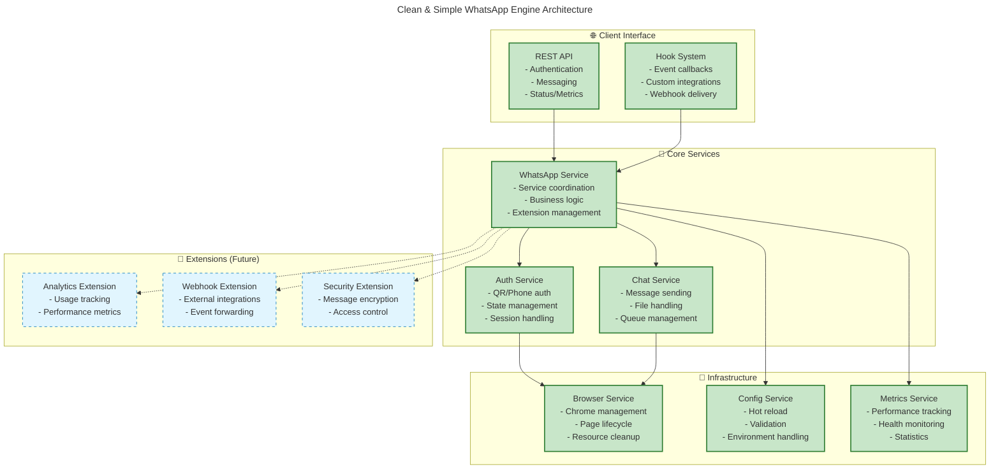

# WhatsApp Engine Rust - Practical Architectural Improvements

## Executive Summary

This document outlines **practical and implementable** architectural improvements for the WhatsApp Engine Rust. These improvements focus on **simplicity, modularity, and extensibility** for on-premise deployments while maintaining the excellent foundation you've already built.

## Current Implementation Status ✅

### **What's Working Well**
- ✅ **Simplified Authentication Flow** - State machine approach implemented
- ✅ **Clean Service Architecture** - AuthService, ChatService, BrowserService separation
- ✅ **Unified Configuration** - Single config file with sensible defaults
- ✅ **Error Handling** - Comprehensive timeout and retry mechanisms
- ✅ **REST API** - Clean endpoints with OpenAPI documentation
- ✅ **Browser Management** - Singleton pattern with proper cleanup
- ✅ **Async Architecture** - Tokio-based with proper concurrency

### **Areas for Simple Improvements**
- 🔧 **Plugin System** - Add extensibility without complexity
- 🔧 **Local Events** - Simple hook system for integrations
- 🔧 **Configuration Hot-reload** - Runtime config changes
- 🔧 **Better Observability** - Enhanced logging and metrics
- 🔧 **Extension Points** - Hooks for future enhancements

---

## 🎯 Practical Improvements (On-Premise Focused)

### 1. **Simple Plugin/Hook System** ⭐ Priority 1

**Goal**: Add extensibility points without over-engineering

```rust
// Simple hook system - easy to implement
pub trait WhatsAppHook: Send + Sync {
    async fn on_auth_success(&self, sender_id: &str) -> Result<()> { Ok(()) }
    async fn on_auth_failure(&self, error: &str) -> Result<()> { Ok(()) }
    async fn on_message_sent(&self, to: &str, content: &str) -> Result<()> { Ok(()) }
    async fn on_message_failed(&self, to: &str, error: &str) -> Result<()> { Ok(()) }
}

pub struct HookManager {
    hooks: Vec<Box<dyn WhatsAppHook>>,
}

impl HookManager {
    pub fn register_hook(&mut self, hook: Box<dyn WhatsAppHook>) {
        self.hooks.push(hook);
    }
    
    pub async fn trigger_auth_success(&self, sender_id: &str) -> Result<()> {
        for hook in &self.hooks {
            if let Err(e) = hook.on_auth_success(sender_id).await {
                tracing::warn!("Hook failed: {}", e);
            }
        }
        Ok(())
    }
}
```

**Benefits**:
- Simple to implement (1-2 days)
- Easy to extend with custom logic
- No complex dependency injection needed
- Perfect for webhooks, logging, analytics

### 2. **Configuration Hot-Reload** ⭐ Priority 2

**Goal**: Change settings without restart

```rust
// Simple file watcher for config changes
pub struct ConfigWatcher {
    config: Arc<RwLock<AppConfig>>,
    file_path: PathBuf,
    last_modified: SystemTime,
}

impl ConfigWatcher {
    pub async fn start_watching(&mut self) -> Result<()> {
        let mut interval = tokio::time::interval(Duration::from_secs(5));
        
        loop {
            interval.tick().await;
            
            if let Ok(metadata) = fs::metadata(&self.file_path) {
                if let Ok(modified) = metadata.modified() {
                    if modified > self.last_modified {
                        if let Ok(new_config) = AppConfig::load() {
                            let mut config = self.config.write().await;
                            *config = new_config;
                            self.last_modified = modified;
                            info!("Configuration reloaded");
                        }
                    }
                }
            }
        }
    }
}
```

**Benefits**:
- No restart needed for config changes
- Simple implementation
- Great for debugging and tuning
- Foundation for feature flags later

### 3. **Enhanced Observability** ⭐ Priority 3

**Goal**: Better visibility into what's happening

```rust
// Simple metrics collection
#[derive(Debug, Default)]
pub struct WhatsAppMetrics {
    pub auth_attempts: AtomicU64,
    pub auth_successes: AtomicU64,
    pub messages_sent: AtomicU64,
    pub messages_failed: AtomicU64,
    pub browser_restarts: AtomicU64,
    pub uptime_seconds: AtomicU64,
}

impl WhatsAppMetrics {
    pub fn increment_auth_attempt(&self) {
        self.auth_attempts.fetch_add(1, Ordering::Relaxed);
    }
    
    pub fn get_success_rate(&self) -> f64 {
        let attempts = self.auth_attempts.load(Ordering::Relaxed);
        let successes = self.auth_successes.load(Ordering::Relaxed);
        
        if attempts == 0 { 0.0 } else { successes as f64 / attempts as f64 }
    }
    
    pub fn to_json(&self) -> serde_json::Value {
        serde_json::json!({
            "auth_attempts": self.auth_attempts.load(Ordering::Relaxed),
            "auth_successes": self.auth_successes.load(Ordering::Relaxed),
            "success_rate": self.get_success_rate(),
            "messages_sent": self.messages_sent.load(Ordering::Relaxed),
            "messages_failed": self.messages_failed.load(Ordering::Relaxed),
            "browser_restarts": self.browser_restarts.load(Ordering::Relaxed),
            "uptime_seconds": self.uptime_seconds.load(Ordering::Relaxed)
        })
    }
}
```

**New Endpoint**:
```rust
// GET /api/metrics
pub async fn get_metrics(State(service): State<Arc<WhatsAppService>>) -> Json<serde_json::Value> {
    Json(service.get_metrics().to_json())
}
```

### 4. **Simple Extension Points** ⭐ Priority 4

**Goal**: Prepare for future enhancements without complexity

```rust
// Extension trait for future features
pub trait WhatsAppExtension: Send + Sync {
    fn name(&self) -> &'static str;
    fn enabled(&self) -> bool { true }
    
    // Future extension points
    async fn pre_auth(&self, _method: &str) -> Result<()> { Ok(()) }
    async fn post_auth(&self, _result: &AuthResult) -> Result<()> { Ok(()) }
    async fn pre_message(&self, _message: &MessageRequest) -> Result<()> { Ok(()) }
    async fn post_message(&self, _result: &MessageResult) -> Result<()> { Ok(()) }
}

// Simple extension manager
pub struct ExtensionManager {
    extensions: HashMap<String, Box<dyn WhatsAppExtension>>,
}
```

---

## 🏗️ Simplified Architecture



---

## 📋 Implementation Roadmap

### **Phase 1: Foundation (1-2 weeks)**
1. ✅ **Already Done**: Clean up existing documentation
2. 🔧 **Add Hook System**: Simple event callbacks (2-3 days)
3. 🔧 **Add Metrics Endpoint**: Basic performance tracking (1-2 days)
4. 🔧 **Config Hot-reload**: File watching (2-3 days)

### **Phase 2: Enhancement (1-2 weeks)**
1. 🔧 **Extension Framework**: Prepare for future plugins (3-4 days)
2. 🔧 **Enhanced Logging**: Structured logs with context (2-3 days)
3. 🔧 **Health Checks**: Detailed service status (2-3 days)

### **Phase 3: Polish (1 week)**
1. 🔧 **Documentation**: Update all docs to match reality
2. 🔧 **Testing**: Comprehensive integration tests
3. 🔧 **Examples**: Sample hooks and extensions

---

## 💡 Example Implementations

### Simple Webhook Hook
```rust
pub struct WebhookHook {
    webhook_url: String,
    client: reqwest::Client,
}

#[async_trait]
impl WhatsAppHook for WebhookHook {
    async fn on_message_sent(&self, to: &str, content: &str) -> Result<()> {
        let payload = serde_json::json!({
            "event": "message_sent",
            "to": to,
            "content": content,
            "timestamp": chrono::Utc::now().timestamp()
        });
        
        let _ = self.client
            .post(&self.webhook_url)
            .json(&payload)
            .send()
            .await;
            
        Ok(())
    }
}
```

### Simple Analytics Extension
```rust
pub struct AnalyticsExtension {
    enabled: bool,
    stats: Arc<Mutex<HashMap<String, u64>>>,
}

#[async_trait]
impl WhatsAppExtension for AnalyticsExtension {
    fn name(&self) -> &'static str { "analytics" }
    fn enabled(&self) -> bool { self.enabled }
    
    async fn post_message(&self, result: &MessageResult) -> Result<()> {
        let mut stats = self.stats.lock().await;
        match result {
            MessageResult::Success => *stats.entry("messages_sent".to_string()).or_insert(0) += 1,
            MessageResult::Failed(_) => *stats.entry("messages_failed".to_string()).or_insert(0) += 1,
        }
        Ok(())
    }
}
```

---

## 🎯 Benefits of This Approach

### **Immediate Benefits**
- ✅ **Keep current working code** - no breaking changes
- ✅ **Add extensibility** - hooks for custom logic
- ✅ **Better monitoring** - metrics and health checks
- ✅ **Runtime configuration** - no restart needed

### **Future Benefits**
- 🚀 **Plugin ecosystem** - community extensions
- 🚀 **Cloud migration path** - when needed
- 🚀 **Enterprise features** - built on solid foundation
- 🚀 **Easier maintenance** - clear extension points

### **No Over-engineering**
- ❌ **No complex DI containers**
- ❌ **No event sourcing (yet)**
- ❌ **No microservices**
- ❌ **No distributed systems complexity**

---

## 🔧 Suggested Configuration Updates

```toml
# config/app.toml - Enhanced but simple

[server]
host = "0.0.0.0"
port = 3000

[browser]
headless = true
timeout_ms = 30000

[auth]
api_token = "your-secure-token-here"
operation_timeout_ms = 30000
retry_attempts = 3

[hooks]
enabled = true
webhook_url = ""  # Optional webhook endpoint

[metrics]
enabled = true
export_interval_seconds = 60

[extensions]
enabled = true
directory = "./extensions"  # Future: load external extensions

[logging]
level = "info"
structured = true
```

---

## 🎯 Next Steps

1. **Review current working code** - ensure documentation matches reality
2. **Implement hook system** - start with simple event callbacks
3. **Add metrics endpoint** - basic performance tracking
4. **Test everything** - ensure no regressions
5. **Document what works** - clean, honest documentation

This approach gives you **immediate value** while keeping the door open for future enhancements without over-engineering the current solution.

Would you like me to start implementing any of these improvements or focus on cleaning up specific documentation first?
